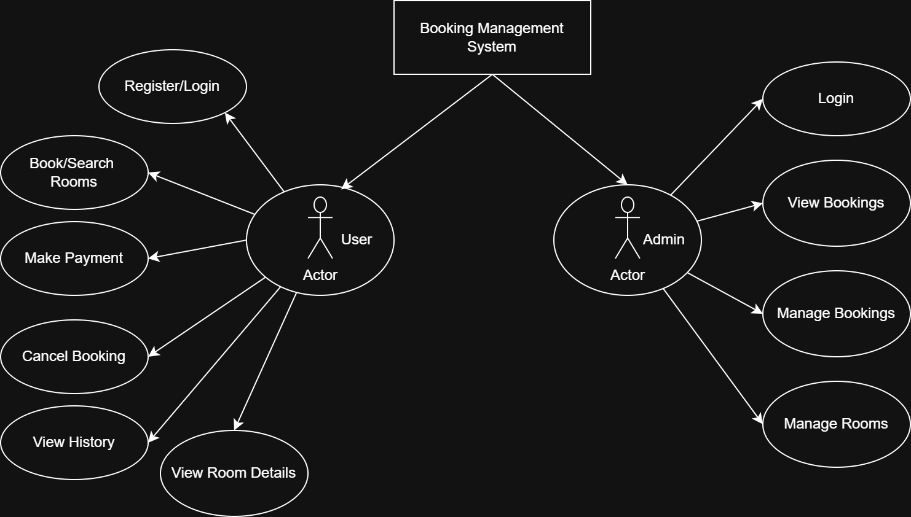

# Requirement Analysis in Software Development

## 📘 Introduction

This repository contains a structured breakdown of the **Requirement Analysis Project**, a simulation of a real-world software development scenario focused on defining requirements for a **Booking Management System**. It guides learners through each phase of requirement analysis—laying a strong foundation for system design, development, and stakeholder alignment.

---

## 🧠 What is Requirement Analysis?

**Requirement Analysis** is the process of identifying, gathering, analyzing, and documenting the needs and expectations of stakeholders for a software system. It is a foundational step in the Software Development Life Cycle (SDLC), ensuring that developers and clients share a clear and common understanding of what the software must do.

Effective requirement analysis:
- Defines the scope and goals of the project.
- Identifies constraints and potential risks.
- Provides the basis for planning, design, and testing.

---

## ❓ Why is Requirement Analysis Important?

Requirement Analysis plays a crucial role in the success of any software project. Here are three key reasons why it matters:

1. **Improves Clarity and Alignment**
   - Ensures that all stakeholders have a shared understanding of the project scope and deliverables.

2. **Reduces Development Risks**
   - Identifies gaps, contradictions, or unrealistic expectations early, preventing rework or project failure.

3. **Guides Design and Testing**
   - Acts as a blueprint for design, development, and quality assurance activities.

---

## 🔍 Key Activities in Requirement Analysis

Requirement Analysis involves several key activities that work together to produce complete, validated requirements:

- **Requirement Gathering**
  - Collecting needs from stakeholders through interviews, surveys, or observation.

- **Requirement Elicitation**
  - Clarifying and expanding gathered information to uncover hidden or implicit needs.

- **Requirement Documentation**
  - Structuring the requirements in a formal document or repository (e.g., SRS or README).

- **Requirement Analysis and Modeling**
  - Analyzing requirements for feasibility, priority, and consistency. Creating models like use case diagrams.

- **Requirement Validation**
  - Confirming with stakeholders that the documented requirements are correct and complete.

---

## 📂 Types of Requirements

Requirements are generally divided into **Functional** and **Non-functional** types.

### ✅ Functional Requirements

These describe what the system **should do**—its features and interactions.

**Examples for the Booking Management System:**
- Users can create a booking for a hotel room.
- Admins can view, edit, or delete bookings.
- Users can receive email confirmations after a successful reservation.

### ⚙️ Non-functional Requirements

These define how the system **should behave**, focusing on quality attributes.

**Examples for the Booking Management System:**
- The system should load all pages within 2 seconds.
- Data must be encrypted during transmission.
- The system should support at least 1,000 concurrent users.

---

## 🧾 Use Case Diagrams

Use Case Diagrams visually represent the interactions between **actors** (users or systems) and **use cases** (functions or services) in the system.

**Benefits of Use Case Diagrams:**
- Clarify system boundaries and user interactions.
- Help stakeholders visualize how the system behaves.
- Aid developers in identifying required features and flows.

**Diagram:**

*Note: The above diagram was created using [Draw.io](https://draw.io) and illustrates the main actors (e.g., User, Admin) and system functions (e.g., Book Room, View Booking, Cancel Booking).*

---

## 🧾 Acceptance Criteria

**Acceptance Criteria** are conditions that a software feature must meet to be accepted by stakeholders. They ensure features deliver the intended value and are testable and verifiable.

**Importance:**
- Defines when a feature is "done."
- Sets clear expectations between developers and clients.
- Guides testing and quality assurance.

**Example – Checkout Feature Acceptance Criteria:**
- ✅ Users must be able to view a summary of their selected room, dates, and pricing.
- ✅ Users must be able to enter and validate payment information.
- ✅ On successful payment, users must receive a confirmation screen and email.
- ✅ Payment must be processed securely using an integrated payment gateway.

---

## ✅ Conclusion

By completing this project, I have learned how to:
- Define and document detailed software requirements.
- Differentiate between functional and non-functional needs.
- Create use case diagrams to model system behavior.
- Establish acceptance criteria to ensure quality and alignment.

This documentation represents a professional and industry-standard approach to the **Requirement Analysis Phase** of software development.
